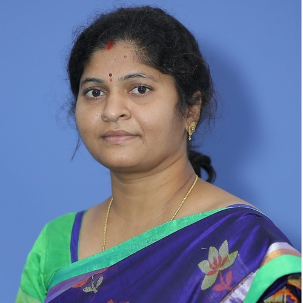

<!--First row-->

	

		

		 
			

				<h6>Dr. S. Ravivarman</h6>
				
Professor, EEE

			

		

	

	

		

		  
			

				<h6>Dr. J. Krishna Chaitanya</h6>
				
Associate Professor, ECE

			

		

	

  
  
	

		

		  
			

				<h6>Dr. C. Padmini</h6>
				
Assistant Professor, ECE

			

		

	

  
	

		

		  
			

				<h6>M. Akhil Kumar</h6>
				
Assistant Professor, CE

			

		

	

	
	

		

		  
			

				<h6>Ms. T. Bhavani Chowdary</h6>
				
Assistant Professor, CE

			

		

	

	

<!--Second row-->

	

		

		 
			

				<h6>Mr. D. Jagadeesh</h6>
				
Assistant Professor, CE

			

		

	

	

		

		  
			

				<h6>Dr. B. Raja Rajeshwari</h6>
				
Assistant Professor, CE

			

		

	

  
  
	

		

		  
			

				<h6>Ms. K. Ashwini</h6>
				
Assistant Professor, ECE

			

		

	

  
	

		

		  
			

				<h6>Dr. I. Babu</h6>
				
Assistant Professor, ECE

			

		

	

<!--Third row-->

	

		

		 
			

				<h6>Mr. P. Bhargava</h6>
				
Assistant Professor, ECE

			

		

	

	

		

		  
			

				<h6>Mr. M. Gopi Krishna</h6>
				
Assistant Professor, ECE

			

		

	

  
  
	

		

		  
			

				<h6>Ms. A. Jaya Lakshmi</h6>
				
Assistant Professor, ECE

			

		

	

  
	

		

		  
			

				<h6>Ms. V. Jyothi</h6>
				
Assistant Professor, ECE

			

		

	

<!--Fourth row-->

	

		

		 
			

				<h6>Mr. P. Bhargava</h6>
				
Assistant Professor, ECE

			

		

	

	

		

		  
			

				<h6>Mr. M. Gopi Krishna</h6>
				
Assistant Professor, ECE

			

		

	

  
  
	

		

		  
			

				<h6>Ms. A. Jaya Lakshmi</h6>
				
Assistant Professor, ECE

			

		

	

  
	

		

		  
			

				<h6>Ms. V. Jyothi</h6>
				
Assistant Professor, ECE

			

		

	

